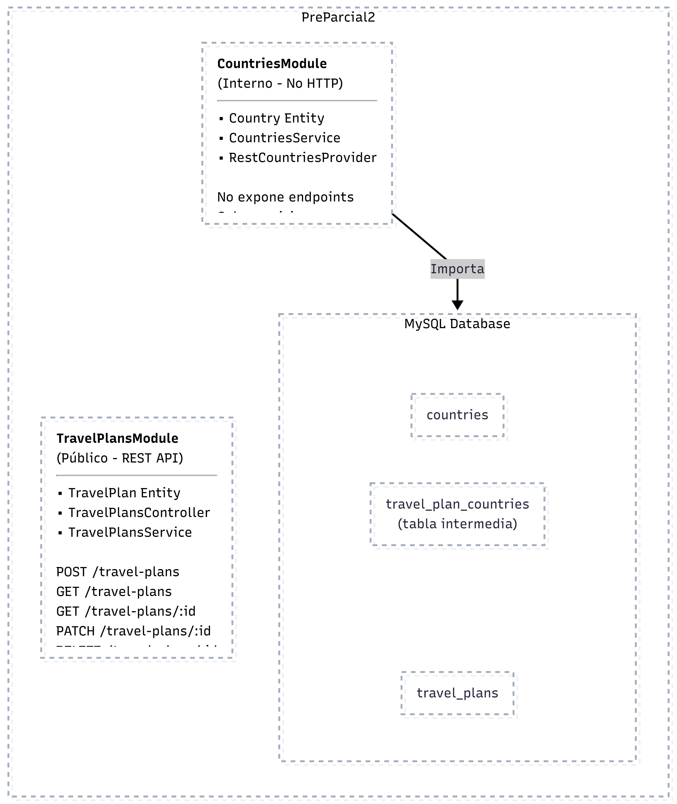
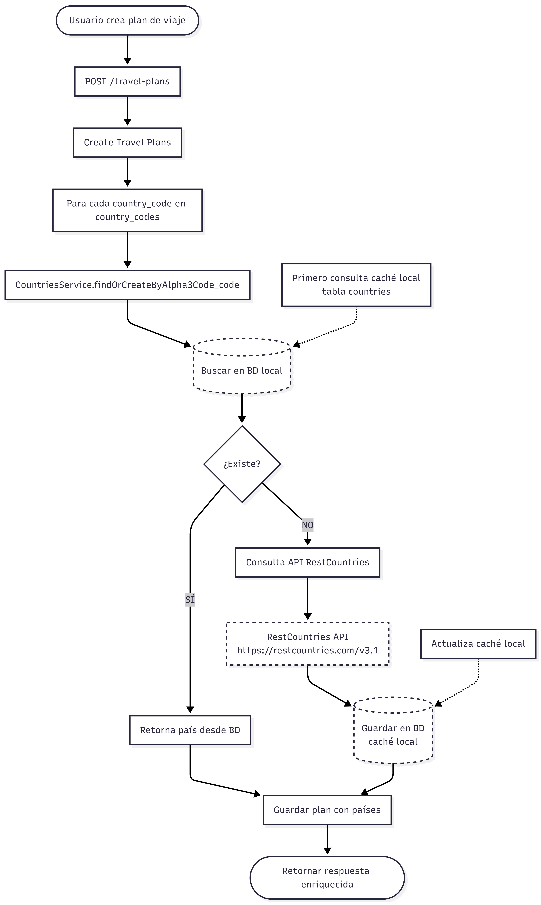

# PreParcial 2

## Arquitectura

### Módulos



### Flujo de Caché de Países



## Estructura del Proyecto

```
PreParcial2/
├── docker-compose.yml
├── diagrama_arquitectura.png
├── diagrama_cache_paises.png
├── Dockerfile
├── nest-cli.json
├── package.json
├── pnpm-lock.yaml
├── pnpm-workspace.yaml
├── README.md
├── src/
│   ├── app.module.ts
│   ├── countries/
│   │   ├── countries.module.ts
│   │   ├── entities/
│   │   │   └── country.entity.ts
│   │   ├── providers/
│   │   │   └── rest-countries.provider.ts
│   │   └── services/
│   │       └── countries.service.ts
│   ├── main.ts
│   └── travel-plans/
│       ├── controllers/
│       │   └── travel-plans.controller.ts
│       ├── dto/
│       │   ├── create-travel-plan.dto.ts
│       │   └── update-travel-plan.dto.ts
│       ├── entities/
│       │   └── travel-plan.entity.ts
│       ├── services/
│       │   └── travel-plans.service.ts
│       └── travel-plans.module.ts
└── tsconfig.json
```

## Instalación y Ejecución

### Opción 1: Usando Docker Compose (Recomendado)

1. **Clonar el repositorio:**

```bash
cd travel-plans-api
```

2. **Crear archivo de entorno:**

```bash
cp .env.example .env
```

3. **Iniciar los servicios:**

```bash
docker-compose up -d
```

Esto iniciará:
- MySQL en el puerto 3306
- API NestJS en el puerto 3000

4. **Verificar que todo funciona:**

```bash
# Ver logs de la aplicación
docker-compose logs -f app

# Probar endpoint
curl http://localhost:3000/travel-plans
```

### Opción 2: Desarrollo Local

**Requisitos previos:**
- Node.js 20+
- MySQL 8.0+

1. **Instalar dependencias:**

```bash
npm install
```

2. **Configurar base de datos MySQL:**

Crear una base de datos en MySQL:

```sql
CREATE DATABASE travel_plans_db CHARACTER SET utf8mb4 COLLATE utf8mb4_unicode_ci;
CREATE USER 'traveluser'@'localhost' IDENTIFIED BY 'travelpass';
GRANT ALL PRIVILEGES ON travel_plans_db.* TO 'traveluser'@'localhost';
FLUSH PRIVILEGES;
```

3. **Configurar variables de entorno:**

```bash
cp .env.example .env
```

Editar `.env` con tus credenciales:

```env
DB_HOST=localhost
DB_PORT=3306
DB_USERNAME=traveluser
DB_PASSWORD=travelpass
DB_NAME=travel_plans_db
DB_SYNCHRONIZE=true
PORT=3000
```

4. **Iniciar en modo desarrollo:**

```bash
npm run start:dev
```

La API estará disponible en: `http://localhost:3000`

## API Endpoints

### 1. Crear un Plan de Viaje

**POST** `/travel-plans`

Crea un nuevo plan de viaje con múltiples países. Los países se validan y se obtienen de la caché local o de la API externa.

**Request:**

```json
{
  "title": "Viaje por Sudamérica",
  "start_date": "2024-06-01",
  "end_date": "2024-06-15",
  "country_codes": ["COL", "PER", "CHL"]
}
```

**Validaciones:**
- `title`: Requerido, entre 3 y 255 caracteres
- `start_date`: Requerido, formato ISO 8601 (YYYY-MM-DD)
- `end_date`: Requerido, formato ISO 8601, debe ser posterior a `start_date`
- `country_codes`: Requerido, array con al menos 1 código de país (máximo 50)

**Response (201 Created):**

```json
{
  "id": 1,
  "title": "Viaje por Sudamérica",
  "start_date": "2024-06-01T00:00:00.000Z",
  "end_date": "2024-06-15T00:00:00.000Z",
  "countries": [
    {
      "alpha3_code": "COL",
      "name": "Colombia",
      "region": "Americas",
      "capital": "Bogotá",
      "flag_url": "https://flagcdn.com/w320/co.png"
    },
    {
      "alpha3_code": "PER",
      "name": "Peru",
      "region": "Americas",
      "capital": "Lima",
      "flag_url": "https://flagcdn.com/w320/pe.png"
    },
    {
      "alpha3_code": "CHL",
      "name": "Chile",
      "region": "Americas",
      "capital": "Santiago",
      "flag_url": "https://flagcdn.com/w320/cl.png"
    }
  ],
  "created_at": "2024-01-15T10:30:00.000Z",
  "updated_at": "2024-01-15T10:30:00.000Z"
}
```

### 2. Listar Todos los Planes

**GET** `/travel-plans`

Obtiene todos los planes de viaje registrados con información enriquecida de los países.

**Response (200 OK):**

```json
[
  {
    "id": 1,
    "title": "Viaje por Sudamérica",
    "start_date": "2024-06-01T00:00:00.000Z",
    "end_date": "2024-06-15T00:00:00.000Z",
    "countries": [
      {
        "alpha3_code": "COL",
        "name": "Colombia",
        "region": "Americas",
        "capital": "Bogotá",
        "flag_url": "https://flagcdn.com/w320/co.png"
      }
    ],
    "created_at": "2024-01-15T10:30:00.000Z",
    "updated_at": "2024-01-15T10:30:00.000Z"
  }
]
```

### 3. Obtener Plan por ID

**GET** `/travel-plans/:id`

Obtiene el detalle de un plan específico.

**Response (200 OK):**

```json
{
  "id": 1,
  "title": "Viaje por Sudamérica",
  "start_date": "2024-06-01T00:00:00.000Z",
  "end_date": "2024-06-15T00:00:00.000Z",
  "countries": [...],
  "created_at": "2024-01-15T10:30:00.000Z",
  "updated_at": "2024-01-15T10:30:00.000Z"
}
```

**Error (404 Not Found):**

```json
{
  "statusCode": 404,
  "message": "Plan de viaje con ID 999 no encontrado",
  "error": "Not Found"
}
```

### 4. Actualizar Plan de Viaje

**PATCH** `/travel-plans/:id`

Actualiza parcialmente un plan existente.

**Request:**

```json
{
  "title": "Viaje extendido por Sudamérica",
  "end_date": "2024-06-20"
}
```

**Response (200 OK):**

```json
{
  "id": 1,
  "title": "Viaje extendido por Sudamérica",
  "start_date": "2024-06-01T00:00:00.000Z",
  "end_date": "2024-06-20T00:00:00.000Z",
  "countries": [...],
  "created_at": "2024-01-15T10:30:00.000Z",
  "updated_at": "2024-01-15T11:00:00.000Z"
}
```

### 5. Eliminar Plan de Viaje

**DELETE** `/travel-plans/:id`

Elimina un plan de viaje del sistema.

**Response (200 OK):**

```json
{
  "message": "Plan de viaje con ID 1 eliminado exitosamente"
}
```

## Ejemplos de Uso con Postman/cURL

### Crear un Plan de Viaje

```bash
curl -X POST http://localhost:3000/travel-plans \
  -H "Content-Type: application/json" \
  -d '{
    "title": "Viaje por Europa",
    "start_date": "2024-07-01",
    "end_date": "2024-07-20",
    "country_codes": ["ESP", "FRA", "ITA"]
  }'
```

### Obtener Todos los Planes

```bash
curl http://localhost:3000/travel-plans
```

### Obtener Plan Específico

```bash
curl http://localhost:3000/travel-plans/1
```

### Actualizar Plan

```bash
curl -X PATCH http://localhost:3000/travel-plans/1 \
  -H "Content-Type: application/json" \
  -d '{
    "title": "Gran Viaje por Europa"
  }'
```

### Eliminar Plan

```bash
curl -X DELETE http://localhost:3000/travel-plans/1
```

## Códigos de País Disponibles

La API utiliza códigos Alpha-3 (ISO 3166-1). Algunos ejemplos:

| Código | País |
|--------|------|
| COL | Colombia |
| PER | Perú |
| CHL | Chile |
| ARG | Argentina |
| BRA | Brasil |
| MEX | México |
| ESP | España |
| FRA | Francia |
| ITA | Italia |
| USA | Estados Unidos |
| CAN | Canadá |
| JPN | Japón |
| CHN | China |

Lista completa: https://en.wikipedia.org/wiki/ISO_3166-1_alpha-3

## Comandos Útiles

### Docker

```bash
# Iniciar servicios
docker-compose up -d

# Ver logs
docker-compose logs -f app
docker-compose logs -f db

# Detener servicios
docker-compose down

# Eliminar volúmenes (limpiar base de datos)
docker-compose down -v

# Reconstruir imágenes
docker-compose up -d --build
```

### Desarrollo

```bash
# Instalar dependencias
npm install

# Iniciar en modo desarrollo
npm run start:dev

# Compilar para producción
npm run build

# Ejecutar tests
npm run test

# Linting
npm run lint
```

## Limpieza de Base de Datos

Para limpiar la base de datos antes de entregar el proyecto:

### Opción 1: Usando Docker

```bash
# Eliminar contenedores y volúmenes
docker-compose down -v

# Recrear desde cero
docker-compose up -d
```

### Opción 2: Usando MySQL Client

```sql
-- Eliminar todas las tablas
DROP TABLE IF EXISTS travel_plan_countries;
DROP TABLE IF EXISTS travel_plans;
DROP TABLE IF EXISTS countries;

-- O eliminar y recrear la base de datos
DROP DATABASE IF EXISTS travel_plans_db;
CREATE DATABASE travel_plans_db CHARACTER SET utf8mb4 COLLATE utf8mb4_unicode_ci;
```

## Decisiones Técnicas

### 1. **Arquitectura Modular**

- **CountriesModule**: Módulo interno sin controladores. Solo exporta `CountriesService` para uso interno.
- **TravelPlansModule**: Módulo público que importa `CountriesModule` y expone endpoints REST.

Esta separación asegura que la lógica de países no sea accesible directamente vía HTTP.

### 2. **Lógica de Caché**

- Primera llamada: Consulta API externa → Guarda en BD → Retorna
- Siguientes llamadas: Consulta BD local → Retorna directamente

Beneficios:
- Reduce llamadas a API externa (rate limiting)
- Mejora performance
- Permite funcionar offline si la BD está poblada

### 3. **Relaciones Muchos-a-Muchos**

Un plan puede tener múltiples países, y un país puede estar en múltiples planes.
TypeORM maneja automáticamente la tabla intermedia `travel_plan_countries`.

### 4. **Validación con DTOs**

Uso de `class-validator` para validaciones automáticas:
- Formato ISO 8601 para fechas
- Rangos de caracteres
- Validación de arrays
- Sanitización de entradas

### 5. **Docker Multi-Stage**

El Dockerfile usa multi-stage build para:
- Reducir tamaño de imagen final
- Eliminar dependencias de desarrollo
- Mejorar seguridad

## Solución de Problemas

### Error de conexión a MySQL

```
Error: connect ECONNREFUSED
```

**Solución:** Asegúrate de que MySQL esté corriendo y las credenciales sean correctas en `.env`.

### Error de sincronización TypeORM

Si hay errores de esquema:

```bash
# Limpiar base de datos
docker-compose down -v
docker-compose up -d
```

O desactivar sincronización automática:

```env
DB_SYNCHRONIZE=false
```

### País no encontrado

Si un código de país no existe en RestCountries:

```json
{
  "statusCode": 400,
  "message": "Los siguientes códigos de país no fueron encontrados: XYZ",
  "error": "Bad Request"
}
```

Verificar que el código sea válido en https://en.wikipedia.org/wiki/ISO_3166-1_alpha-3
